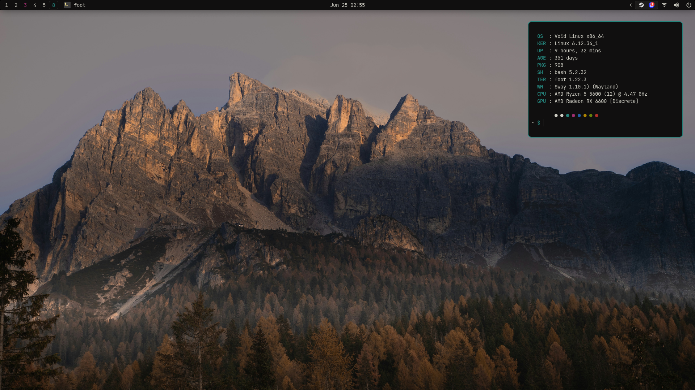
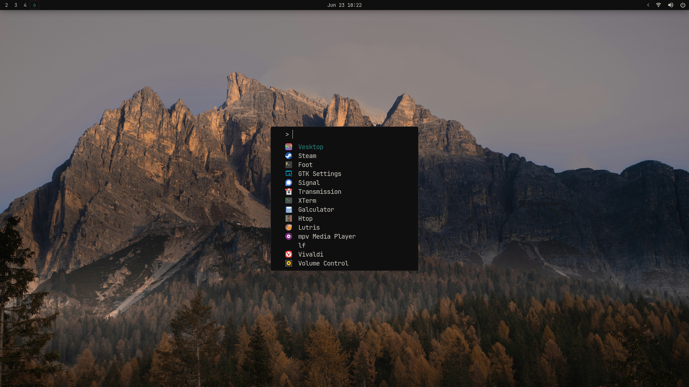
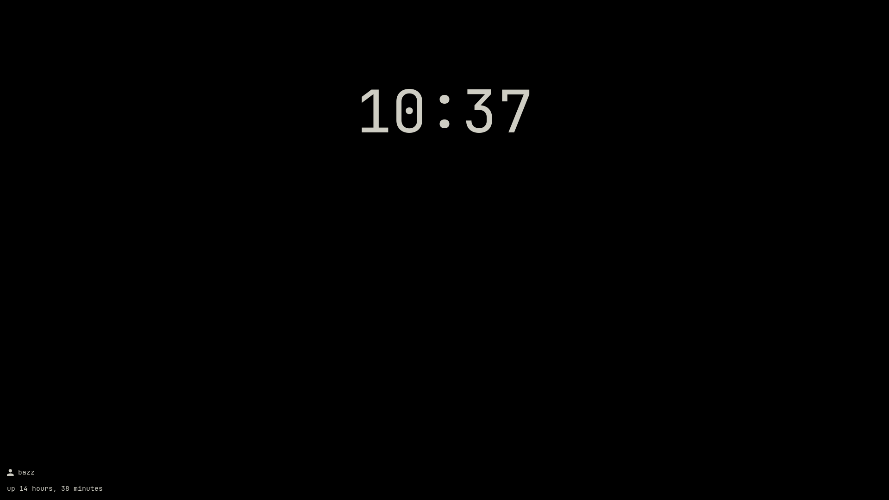
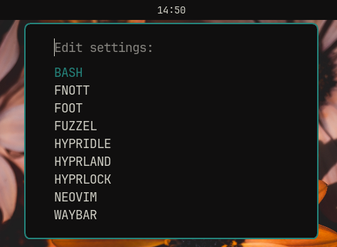
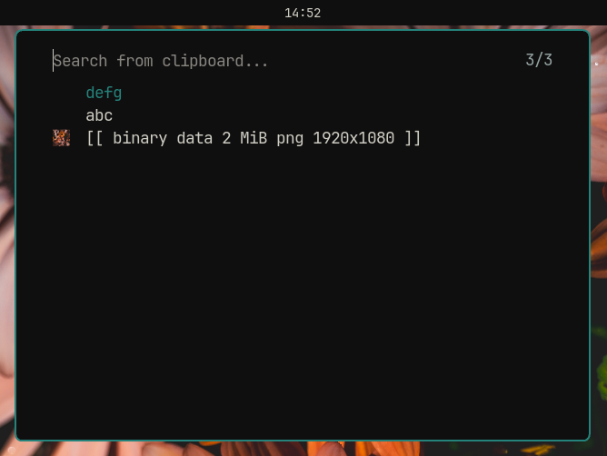
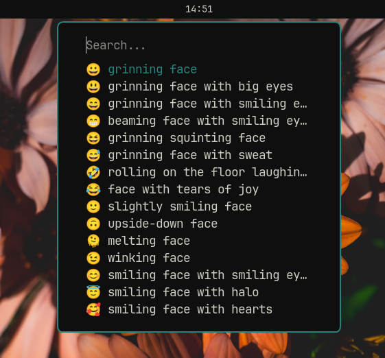

# Dotfiles

My point was to get light weight system without useless annoyances.
I don't use fancy desktop shell's like AGS because I wan't my system to be fast and responsive.

I have used two window managers: **Sway** and **Hyprland** Both have a similar workflow. I currently use Sway because it is lighter and offers a more stable user experience, while Hyprland is more of a test platform.

### Software I use

- Distro: [Arch](https://archlinux.org)
- Bar: [Waybar](https://github.com/Alexays/Waybar)
- WM: [Hyprland](https://github.com/hyprwm/Hyprland) / [Sway](https://github.com/swaywm/sway)
- Colors (mostly): [Flexoki](https://stephango.com/flexoki)
- Editor: [neovim](https://neovim.io/)
- Filemanager: [lf](https://github.com/gokcehan/lf/)
- Fonts: JetBrains Mono
- GTK-theme: [adw-gtk3](https://github.com/lassekongo83/adw-gtk3)
- Image Viewer: [swayimg](https://github.com/artemsen/swayimg)
- Launcher: [fuzzel](https://codeberg.org/dnkl/fuzzel)
- Login Manager: **greetd** with [tuigreet](https://github.com/apognu/tuigreet)
- Media Player: [mpv](https://mpv.io/)
- Notification daemon: [fnott](https://codeberg.org/dnkl/fnott)
- Symbols and icons: [Nerd Font Symbols](https://www.nerdfonts.com/)
- Terminal: [foot](https://codeberg.org/dnkl/foot)

### Screenshots

> Busy
>
> 
> Fuzzel
>
> 
> Lockscreen
>
> 

Some fuzzel menus

> Settings
>
> 
>
> Clipboard
>
> 
>
> Emoji
>
> 

---

### Hotkeys

There are lots of them so I don't list them here

- Tip: press: **Super** + **F3** 😉

---

### Reminder ⚠️

Installation script is still WIP, so please be careful. I don't recommend blindly copying the entire repository, but rather taking bits and pieces from here and there.

---

### Sources where I stole most of my cool stuff ⭐

- [SwayKh](https://github.com/SwayKh/dotfiles/tree/main) - For TONS of ideas and ispiration 😍
- [newmanls](https://github.com/newmanls/dotfiles) - Helped me with TONS of stuff ⭐
- [classabbyamp](https://github.com/classabbyamp) - Helped me with TONS of stuff ⭐
- [aellas](https://github.com/aellas) - For TONS of ideas and ispiration ⭐ ❤️ 🐐
- [Joris](https://codeberg.org/jorisvandijk) - For showing me how to manage my dots better ❤️ ⭐

### Special thanks ⭐

- [fesowowako](https://github.com/fesowowako) and his commits from [My Sway-dotfiles](https://github.com/bitterhalt/dots-sway)
