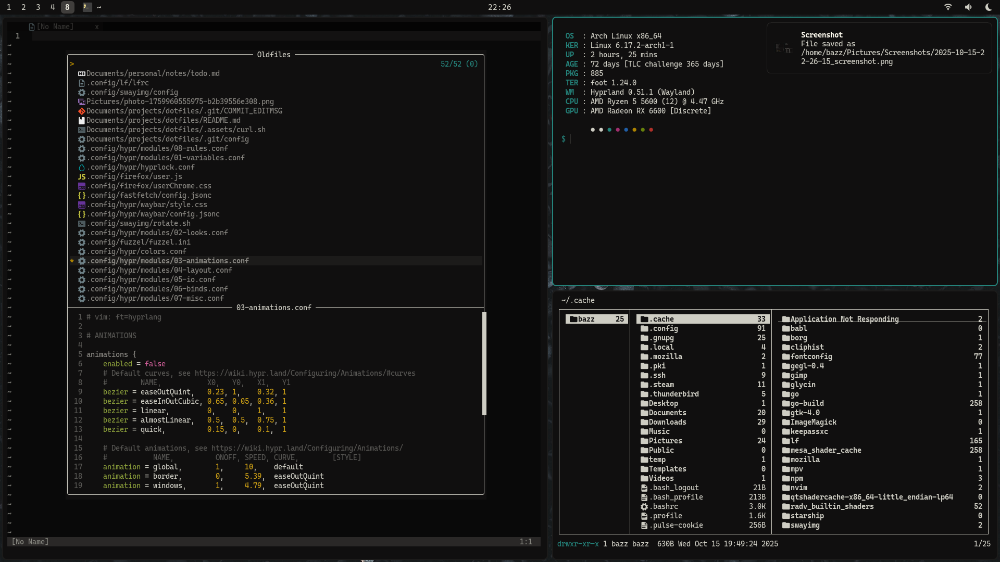
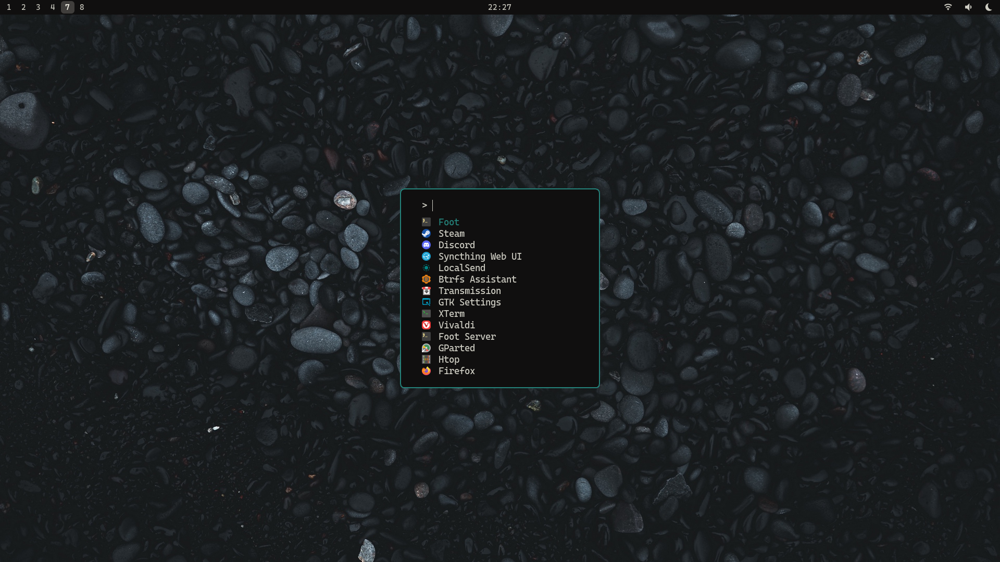

## Dotfiles

> **Hello friend!**
>
> These are the dotfiles of my keyboard-driven environment. I prefer fuction over eyecandy so I'm trying to keep thinks pretty minimal. At the moment I use Hyprland as my main WM and Sway is there for backup, they both have pretty much the same workflow.

### Software I use

- Distro: [Arch](https://archlinux.org)
- Shell: [ignis](https://github.com/ignis-sh/ignis?tab=readme-ov-file)
- WM: [Hyprland](https://github.com/hyprwm/Hyprland)
- Colors (mostly): [Flexoki](https://stephango.com/flexoki)
- Editor: [neovim](https://neovim.io/)
- Filemanager: [lf](https://github.com/gokcehan/lf/)
- Fonts: **Adwaita Sans** / **Cascadia Mono**
- GTK-theme: [adw-gtk3](https://github.com/lassekongo83/adw-gtk3)
- Image Viewer: [swayimg](https://github.com/artemsen/swayimg)
- Launcher: [fuzzel](https://codeberg.org/dnkl/fuzzel)
- Login Manager: **greetd** with [tuigreet](https://github.com/apognu/tuigreet)
- Media Player: [mpv](https://mpv.io/)
- Symbols and icons: [Nerd Font Symbols](https://www.nerdfonts.com/)
- Terminal: [foot](https://codeberg.org/dnkl/foot)

### Screenshots

> Busy
>
> 
>
> 

<details>
<summary><b>Lockscreen</b></summary><br>

</details>
<details>
<summary><b>Notification Center</b></summary><br>

</details>
<details>
<summary><b>Task list</b></summary><br>

</details>

---

### ⌨️ Hotkeys

> These are from hyprland but they are mostle the same with Sway

<details>
<summary><b> Click to see 👈 </b></summary><br>

🚀 Applications & Scripts

| Keys                  | Action                                       |
| --------------------- | -------------------------------------------- |
| Super + Ctrl + C      | Clipboard menu                               |
| Super + Ctrl + D      | Dismiss notifications                        |
| Super + Ctrl + E      | Emoji menu                                   |
| Super + Ctrl + F8     | Start/stop screen recording & refresh Waybar |
| Super + Ctrl + P      | Color picker                                 |
| Super + Ctrl + S      | Sound settings                               |
| Super + D             | App launcher (dmenu)                         |
| Super + E             | TUI file manager                             |
| Super + F1            | Calculator                                   |
| Super + F11           | Screen lock                                  |
| Super + F12           | Dotfile settings                             |
| Super + F2            | LocalSend                                    |
| Super + F3            | Show keybinds                                |
| Super + F4            | Force kill                                   |
| Super + F5            | Password manager                             |
| Super + F8            | Screenshot                                   |
| Super + M             | Mail                                         |
| Super + Print         | Screenshot (full)                            |
| Super + Shift + Del   | Open htop                                    |
| Super + Shift + E     | File manager                                 |
| Super + Shift + F11   | Toggle hypridle + refresh Waybar             |
| Super + Shift + F12   | Gamemode                                     |
| Super + Shift + P     | App launcher (pmenu)                         |
| Super + Shift + Print | Screenshot (region + edit)                   |
| Super + Shift + W     | Wallpaper changer                            |
| Super + T             | Show date notification                       |
| Super + Tab           | Window list                                  |
| Super + V             | Editor                                       |
| Super + W             | Browser                                      |

🖥️ Hyprland Controls

| Keys                    | Action                   |
| ----------------------- | ------------------------ |
| Super + B               | Toggle barless mode      |
| Super + Ctrl + R        | Reload Hyprland config   |
| Super + Return          | Open terminal            |
| Super + Q               | Close active window      |
| Super + Space           | Toggle floating          |
| Super + F               | Fullscreen               |
| Super + Shift + F       | Maximize window          |
| Super + Ctrl + G        | Toggle gaps              |
| Super + Z               | Swap with master         |
| Super + Y               | Pin window               |
| Super + , / .           | Add / remove master      |
| Super + ↑ ↓ ← →         | Move focus               |
| Super + H J K L         | Move focus (Vim)         |
| Super + Shift + ↑ ↓ ← → | Swap windows             |
| Super + Shift + H J K L | Swap windows (Vim)       |
| Super + Ctrl + ↑ ↓ ← →  | Resize window            |
| Super + Ctrl + H J K L  | Resize window (Vim)      |
| Super + 1–9             | Switch to workspace      |
| Super + 0               | Urgent / last workspace  |
| Super + Shift + 1–9     | Move window to workspace |
| Super + C               | Toggle special:chat      |
| Super + Shift + C       | Move to special:chat     |
| Super + X               | Toggle special:zen       |
| Super + Shift + X       | Move to special:zen      |

⌨️ Submaps
| Keys | Submap |
| ------------ | ---------------- |
| Alt + M | Monitor controls |
| Alt + Z | Zoom |
| Super + I | Info |
| Super + N | Notes |
| Super + P | Power |
| Super + PgUp | Apps |
| Super + U | System |

</details>

### 🍫 Barless mode

⌨️ SUPER+B

I use my bar less and less, so recently I made this "barless mode" to launch workspace listener that shows your current workspace.

<details>
<summary><b>Screenshot</b></summary><br>

</details>

---

### Installation

> ⚠️ Installation script is still WIP, so please be careful. I don't recommend blindly copying the entire repository, but rather taking bits and pieces from here and there.

```bash
bash <(curl -L https://codeberg.org/bt-halt/dotfiles/raw/branch/main/.assets/curl.sh)
```

> Note: atm, you can get my ignis shell and componens [here](https://github.com/bitterhalt/comfy-shell)
>
> After main installation scrip clone my ignis repo and move ignis directory ~/.config/

```bash
ignis init -c ~/.config/ignis/config.py
```

> Note this is not recomended daily driving atm, since it WIP and bugs may happen.

---

### Inspiration of my cool stuff ⭐

- [SwayKh](https://github.com/SwayKh/dotfiles/tree/main) - For TONS of ideas and ispiration 😍
- [newmanls](https://github.com/newmanls/dotfiles) - Helped me with TONS of stuff ⭐
- [classabbyamp](https://github.com/classabbyamp) - Helped me with TONS of stuff ⭐
- [aellas](https://github.com/aellas) - For TONS of ideas and ispiration ⭐ ❤️ 🐐
- [Joris](https://codeberg.org/jorisvandijk) - For showing me how to manage my dots better ❤️ ⭐

### Special thanks ⭐

- [fesowowako](https://github.com/fesowowako) and his commits from [My Sway-dotfiles](https://github.com/bitterhalt/dots-sway)
- [NihaAlGhul](https://codeberg.org/NihaAlGhul) For making installation script to actually work ❤️
